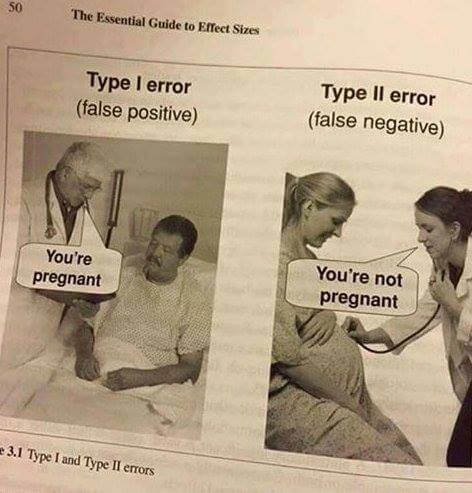

### 1. Introduction: Building The Logistic Model
To show the use of evaluation metrics, I need a classification model. So, let’s build one using logistic regression.

```{r}
# 0. Path to access the data
trainDataPath<- 'https://raw.githubusercontent.com/duttashi/datasets/master/breastcancer_training.csv'
testDataPath<-'https://raw.githubusercontent.com/duttashi/datasets/master/breastcancer_test.csv'

# 1. Import dataset
trainData <- read.csv(trainDataPath)
testData <- read.csv(testDataPath)

# 2. Build Logistic Model
logitmod <- glm(Class ~ Cl.thickness + Cell.size + Cell.shape, family = "binomial", data=trainData)

# 3. Predict on testData
pred <- predict(logitmod, newdata = testData, type = "response")

# 4. If p > .5, then Class is 1 else 0
y_pred <- ifelse(pred > 0.5, 1, 0)
y_act <- testData$Class

# 5. Accuracy
mean(y_pred == y_act)  # 94%

```

The computed accuracy from the above model turned out to be 94%, which sounds pretty good. But, it doesn’t reveal much information about how well the model actually did in predicting the 1’s and 0’s independently.

Nor does it say how well it would have performed with a different prediction probability cutoff.

Let’s have a deeper look into this, starting with the confusion matrix.

### 2. The Confusion Matrix
The caret package provides the awesome confusionMatrix function for this. It takes in the predicted and actual values.

And to avoid confusion, always specify the positive argument.

Otherwise, it is possible for ‘0’ to be taken as ‘positive’ or the ‘event’, and will cause a big mistake which may go unnoticed.

I want ‘malignant’ Class to be ‘positive’ so, I have set positive="1" below.

```{r}
library(caret)
caret::confusionMatrix(y_pred, y_act, positive="1", mode="everything")
```

In the above output, the table in the first 4 lines of the output is the confusion matrix.

The remaining part of the output shows a bunch of more valuable evaluation metrics. Let’s break down what they are.

### 3. How to interpret caret’s confusionMatrix?
First, let’s focus on the first 4 lines of the above output.

 Confusion Matrix and Statistics
```{}
          Reference
Prediction   0    1
          0 122   1
          1  11  70
```
The rows in the confusion matrix are the count of predicted 0’s and 1’s (from y_pred), while, the columns are the actuals (from y_act).

So, you have 122 out of 133 benign instances predicted as benign and 70 out of 71 malignant instances predicted as malignant. This is good.

Secondly, look at the 1 in top-right of the table. This means the model predicted 1 instance as benign which was actually positive.

This is a classic case of ‘False Negative’ or Type II error. You want to avoid this at all costs, because, it says the patient is healthy when he is actually carrying malignant cells.

Also, the model predicted 11 instances as ‘Malignant’ when the patient was actually ‘Benign’. This is called ‘False Positive’ or Type I error. This condition should also be avoided but in this case is not as dangerous as Type II error.



### 4. What is Sensitivity, Specificity and Detection Rate?
Sensitivity is the percentage of actual 1’s that were correctly predicted. It shows what percentage of 1’s were covered by the model.

The total number of 1’s is 71 out of which 70 was correctly predicted. So, sensitivity is 70/71 = 98.59%

Sensitivity matters more when classifying the 1’s correctly is more important than classifying the 0’s. Just like what we need here in `BreastCancer` case, where you don’t want to miss out any malignant to be classified as ‘benign’.

Likewise, Specificity is the proportion of actual 0’s that were correctly predicted. So in this case, it is 122 / (122+11) = 91.73%.

Specificity matters more when classifying the 0’s correctly is more important than classifying the 1’s.

Maximizing specificity is more relevant in cases like spam detection, where you strictly don’t want genuine messages (0’s) to end up in spam (1’s).

Detection rate is the proportion of the whole sample where the events were detected correctly. So, it is 70 / 204 = 34.31%.

You can see further explanation of all the metrics in this wiki link. https://en.wikipedia.org/wiki/Confusion_matrix


### 5. What is Precision, Recall and F1 Score?
Another great way to know the goodness of the model is using the Precision, Recall and the F1 Score.

The approach here is to find what percentage of the model’s positive (1’s) predictions are accurate. This is nothing but Precision.

Let’s suppose you have a model with high precision, I also want to know what percentage of ALL 1’s were covered. This can be captured using Sensitivity.

But in this context, it is known as Recall. Just because, it is customary to call them together as ‘Precision and Recall’.

A high precision score gives more confidence to the model’s capability to classify 1’s. Combining this with Recall gives an idea of how many of the total 1’s it was able to cover.

A good model should have a good precision as well as a high recall. So ideally, I want to have a measure that combines both these aspects in one single metric – the F1 Score.

F1 Score = (2 * Precision * Recall) / (Precision + Recall)

These three metrics can be computed using the `InformationValue` package. But you need to convert the factors to numeric for the functions to work as intended.

```{r}
#install.packages("InformationValue")
#load the package
library(InformationValue)
```

Now the factors are converted to numeric. Let's compute the precision, recall and the F1 Score.

```{r}
actual <- as.factor(as.character(y_act))
pred <- as.factor(as.character(y_pred))
recall_value<-recall(actual, pred)
recall_value
#> 0.999918699
```

```{r}
actual <- as.numeric(as.character(y_act))
pred <- as.numeric(as.character(y_pred))
precision_value<- precision(actual, pred)
precision_value
#> 0.8641975
```
```{r}
# F-measure is 2 * precision * recall / (precision + recall) is
Fmeasure <- 2 * precision_value * recall_value / (precision_value + recall_value)
Fmeasure
```
We get an F1 score of 92 percent. That is pretty good.
6. What is Cohen's Kappa?
Kappa is similar to Accuracy score, but it takes into account the accuracy that would have happened anyway through random predictions.

Kappa = (Observed Accuracy - Expected Accuracy) / (1 - Expected Accuracy)

Cohen's kappa is shown as an output of caret's confusionMatrix function.

### 7. What is KS Statistic and How to interpret KS Chart?
The KS Statistic and the KS Chart (discussed next) are used to make decisions like: How many customers to target for a marketing campaign? or How many customers should we pay for to show ads etc.

So how to compute the Kolmogorov-Smirnov statistic?

Step 1: Once the prediction probability scores are obtained, the observations are sorted by decreasing order of probability scores. This way, you can expect the rows at the top to be classified as 1 while rows at the bottom to be 0's.

Step 2: All observations are then split into 10 equal sized buckets (bins).

Step 3: Then, KS statistic is the maximum difference between the cumulative percentage of responders or 1's (cumulative true positive rate) and cumulative percentage of non-responders or 0's (cumulative false positive rate).

The significance of KS statistic is, it helps to understand, what portion of the population should be targeted to get the highest response rate (1's).

The KS statistic can be computed using the `ks_stat` function in InformationValue package. By setting the `returnKSTable = T`, you can retrieve the table that contains the detailed decile level splits.

```{r}
#library(InformationValue)
ks_stat(y_act, y_pred)

ks_stat(y_act, y_pred, returnKSTable = T)
```
### 8. How to plot Kolmogorov Smirnov Chart in R?
The KS Chart is particularly useful in marketing campaigns and ads click predictions where you want to know the right population size to target to get the maximum response rate.

The KS chart below shows how this might look like. The length of the vertical dashed red line indicates the KS Statistic.
```{r}
ks_plot(y_act, y_pred)
```

By targeting the top 40% of the population (point it touches the X-axis), the model is able to cover 97.18% of responders (1's).

The KS chart and statistic that is widely used in credit scoring scenarios and for selecting the optimal population size of target users for marketing campaigns.

### 9. How to Interpret ROC Curve?
Often, choosing the best model is sort of a balance between predicting the one's accurately or the zeroes accurately. In other words sensitivity and specificity.

But it would be great to have something that captures both these aspects in one single metric.

This is nicely captured by the 'Receiver Operating Characteristics' curve, also called as the ROC curve. In fact, the area under the ROC curve can be used as an evaluation metric to compare the efficacy of the models.

Let's plot the curve and the area using the `plotROC` and `AUROC` functions from `InformationValue` package.
```{r}
InformationValue::plotROC(y_act, pred)
InformationValue::AUROC(y_act, pred)
```
The actuals are contained in y_act and the predictions are contained in pred. You need to pass it in the same order to get the curve right.

The area under the ROC curve is also shown. But how to interpret this plot?

Interpreting the ROC plot is very different from a regular line plot. Because, though there is an X and a Y-axis, you don't read it as: for an X value of 0.25, the Y value is .9.

Instead, what we have here is a line that traces the probability cutoff from 1 at the bottom-left to 0 in the top right.

This is a way of analyzing how the sensitivity and specificity perform for the full range of probability cutoffs, that is from 0 to 1.

Ideally, if you have a perfect model, all the events will have a probability score of 1 and all non-events will have a score of 0. For such a model, the area under the ROC will be a perfect 1.

So, if we trace the curve from bottom left, the value of probability cutoff decreases from 1 towards 0. If you have a good model, more of the real events should be predicted as events, resulting in high sensitivity and low FPR. In that case, the curve will rise steeply covering a large area before reaching the top-right.

Therefore, the larger the area under the ROC curve, the better is your model.

The ROC curve is the only metric that measures how well the model does for different values of prediction probability cutoffs. The `optimalCutoff` function from `InformationValue` can be used to know what cutoff gives the best sensitivity, specificity or both.

### 10. Concordance and Discordance
In an ideal model, the probability scores of all true 1's should be greater than the probability scores of ALL true 0's. Such a model is said to be perfectly concordant and this phenomenon can be measured by Concordance and Discordance.

So how to calculate Concordance?

Let's consider the following 4 observation's actual class and predicted probability scores.

Patient No	True Class	Probability Score
P1	1	0.9
P2	0	0.42
P3	1	0.30
P4	1	0.80
From the above 4 observations, there are 3 possible pairs of 1's and 0's. That is, P1-P2, P3-P2 and P4-P2.

A pair is said to be concordant if the probability score of True 1 is greater than the probability score of True 0.

P1-P2 => 0.9 > 0.42 => Concordant!
P3-P2 => 0.3 < 0.42 => Discordant!
P4-P2 => 0.8 > 0.42 => Concordant!

Out of the 3 pairs, only 2 are concordant. So, the concordance is 2/3 = 0.66 and discordance is 1 - 0.66 = 0.33.

In simpler words, we take all possible combinations of true events and non-events. Concordance is the percentage of pairs, where true event's probability scores are greater than the scores of true non-events.

For a perfect model, this will be 100%. So, the higher the concordance, the better is the quality of the model. This can be computed using the `Concordance` function in InformationValue package.

```{r}
InformationValue::Concordance(y_act, pred)
```
### 11. What is Somers-D Statistic?
Again, Somers D is an evaluation metric to judge the efficacy of the model.

Somers D = (#Concordant Pairs - #Discordant Pairs - #Ties) / Total Pairs
```{r}
somersD(y_act, y_pred) 
```

### 12. What is Gini Coefficient?
Gini Coefficient is an indicator of how well the model outperforms random predictions. It can be computed from the area under the ROC curve using the following formula:

Gini Coefficient = (2 * AUROC) - 1

### 13. Conclusion
Clearly, just the accuracy score is not enough to judge the performance of the models. One or a combination of the following evaluation metrics is typically required to do the job.